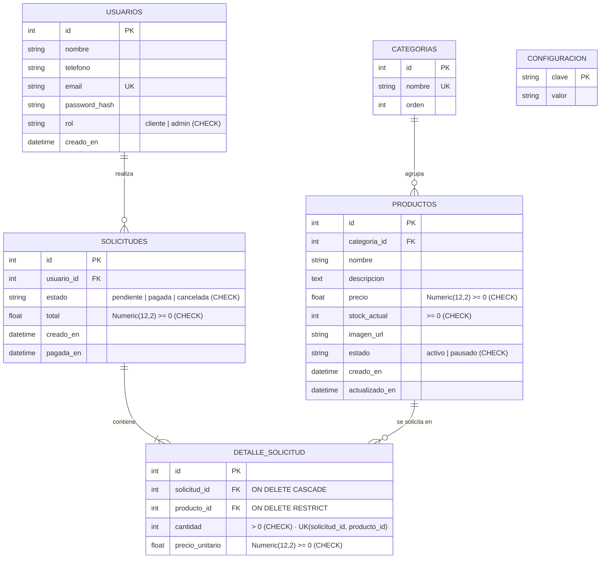

# ERD — Diagrama Entidad-Relación (ARQ-T1)

**Proyecto:** Sistema Web de Catálogo e Inventario — Local de Limpieza
**Autor:** 📐 Arquitecto · **Estado:** ESPERANDO_APROBACIÓN_CHEF
**Fuente de verdad:** `backend/app/models/*.py` + `backend/alembic/versions/0001_initial.py`
**Verificación de paridad:** `cd backend && .venv/bin/python scripts/verify_migration_parity.py`

## Diagrama (Mermaid)

## Notas de diseño

### Restricciones críticas (defensa del negocio a nivel BD)
| Regla | Implementación |
|-------|----------------|
| Stock nunca negativo | `CHECK (stock_actual >= 0)` en `productos` |
| Cantidades válidas | `CHECK (cantidad > 0)` en `detalle_solicitud` |
| Estados válidos | `CHECK` en `productos.estado` y `solicitudes.estado` |
| Roles válidos | `CHECK (rol IN ('cliente','admin'))` en `usuarios` |
| Sin borrados que rompan historial | FKs `ON DELETE RESTRICT` (categorías y productos); el detalle se borra en cascada SOLO con su solicitud |
| Sin duplicados en un carrito | `UNIQUE (solicitud_id, producto_id)` en `detalle_solicitud` |

### Estados
- **Solicitud:** `pendiente → pagada` · `pendiente → cancelada` (transiciones controladas en `services`, CHECK en BD).
- **Producto:** `activo` (visible en catálogo) · `pausado` (oculto temporalmente).
- **Etiquetas de disponibilidad para el cliente** (campo derivado, NUNCA stock numérico):
  - `disponible` → stock > umbral
  - `pocas` → 0 < stock ≤ umbral (`umbral_pocas_unidades`, default 5)
  - `sin_stock` → stock == 0

### Configuración (`configuracion`)
- `umbral_pocas_unidades` (default `"5"`) — configurable por admin (requisito 20.1).

### Seed
- Categorías base: Detergentes, Lavandinas, Desinfectantes, Esponjas y trapos, Aromatizantes, Otros.
- `umbral_pocas_unidades = 5`.
- Idempotente (`backend/app/db/seed.py`).
